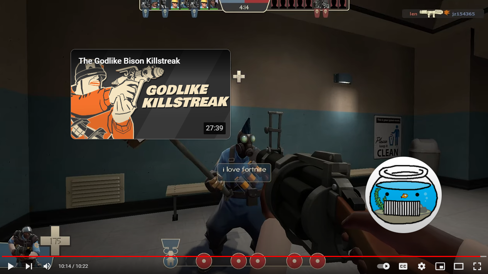
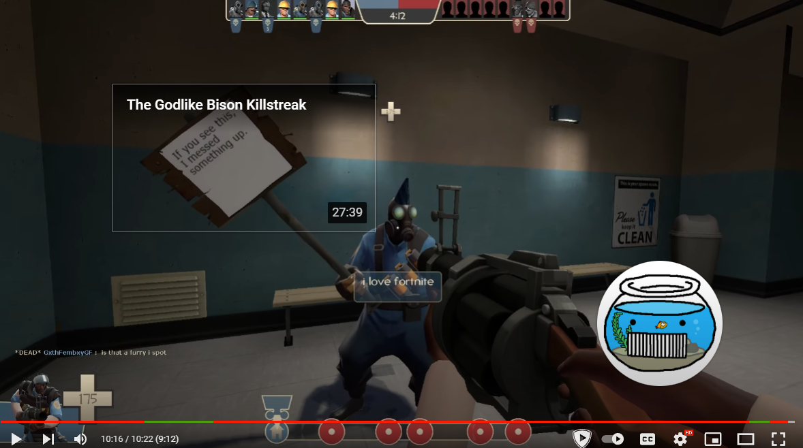

# How to block Youtube endscreen cards quickly

This is a single-line filter for uBlock Origin you can insert to block the mini thumbnail in Youtube endscreen cards. This allows you to see their outline but not fully obstruct the end of the video. You may also remove them entirely.

You don\'t need anything past it, and odds are you already have uBlock Origin. The filtering syntax used in uBlock is very similar to [Adblock Plus'](https://help.eyeo.com/en/adblockplus/how-to-write-filters#elemhide_basic "Adblock Plus'"). You may also use NoScript to do this as well, but that\'s between you and your Schizophrenia therapist.

All this does is simply filter the `ytp-ce-covering-image` CSS element. Leaving you with everything but the tiny thumbnail.

|  element | role   |
| ------------ | ------------ |
|  `ytp-ce-covering-image` | **Mini thumbnail picture in endcard. Filtering this leaves the box, title, timestamp, and slight shadow.**  |
| `ytp-ce-element`  | The entire endcard parent element.   |
| `ytp-ce-covering-shadow-top` | Slight top/title shadow on endcard.
| `ytp-ce-element-shadow` | Very slight shadow on endcard to make titles easier to read.
| `ytp-ce-video-title` | Title of the endcard video(s).
| `ytp-ce-video-duration` | Timestamp of the endcard video(s).

# Applying filter
uBlock Origin browser extension > Settings > My Filters.

Add the following and uncomment anything else you wish to block. 

```
! https://www.youtube.com
www.youtube.com##.ytp-ce-covering-image

! www.youtube.com##.ytp-ce-element
! www.youtube.com##.ytp-ce-covering-shadow-top
! www.youtube.com##.ytp-ce-element-shadow
! www.youtube.com##.ytp-ce-video-title
! www.youtube.com##.ytp-ce-video-duration
```
## Some useful software to make Youtube more bearable
1. [SponsorBlock for YouTube](https://sponsor.ajay.app/ "SponsorBlock for YouTube"): Open-source, crowdsourced extension and API for skipping sponsor, intro/outro, and other undesirable segments in Youtube content. Clients available for iOS/Android, Kodi, and Apple TV among others. 

   * [iSponsorBlockTV](https://github.com/dmunozv04/iSponsorBlockTV "iSponsorBlockTV"): An incredible AppleTV SponsorBlock client that runs on LAN. 

2. [Return YouTube Dislike](https://returnyoutubedislike.com/ "Return YouTube Dislike"): Google\'s action to remove the dislike button is highly misplaced, damaging to YouTube, and above all greedy; as appeasing advertisers is the true intent of this action. This extension and API is open-source, crowdsourced, and uses sophisticated means of returning dislikes. 
    * _BEAR IN MIND_: there are a handful of phony extensions on the respective browser stores that claim to be this. It's unclear why smaller authors are doing this, but with the culture of malware and anti-privacy in unverified extensions, you can take a guess. Please always look for (and support with your $$$ if you can) official projects.
  
3. [Inviduous](https://invidious.io/ "Inviduous"): Open-source and self-hosted `youtube-dl` frontend. Public nodes exist but it's a blast to host a server for your friends/family.


4. **Skip Ads button automation**: This may be done through a browser extension, custom scripts, etc.
    * _BEAR IN MIND_: if you do use a browser extension **do NOT** use the one by author "Shreya Dahal" (github/squgeim/yt-ad-autoskipper and on browser stores). The $7/yr paywall is malicious, as it **blocks truly instant ad skip for free users**. There is a noticeable delay with the core function of this extension made by this greedy greaseball vs others.

## Before & After



Credit: [Fishtank](https://www.youtube.com/watch?v=SjlJ_kjcYN0 "Fishtank"), a great and severely underrated TF2tuber whose successful endscreen troll gave me this idea.
